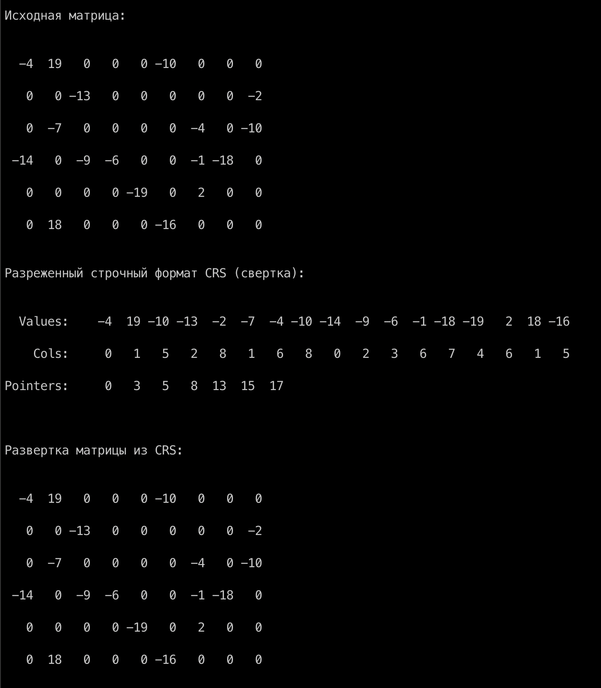

# compressed_row_storage

The program realises simple classes of sparse matrices and the compressed row storage format (CRS).
It contains methods of folding matrices into CRS and unfolding matrices from it.

